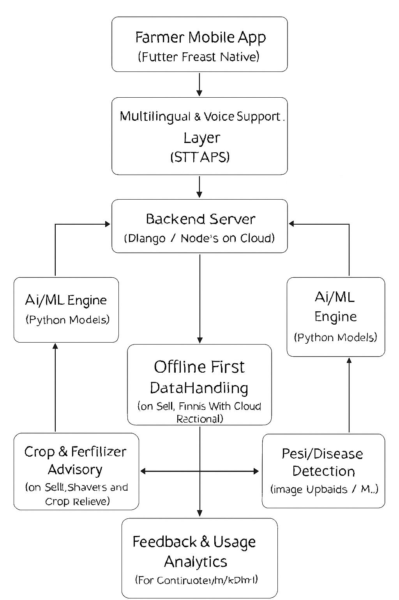

# Smart India Hackathon Workshop
# Date:29.09.2025
## Register Number:25013503
## Name:AASHIF AHAMED S
## Problem Title
SIH 25010: Smart Crop Advisory System for Small and Marginal Farmers
## Problem Description
A majority of small and marginal farmers in India rely on traditional knowledge, local shopkeepers, or guesswork for crop selection, pest control, and fertilizer use. They lack access to personalized, real-time advisory services that account for soil type, weather conditions, and crop history. This often leads to poor yield, excessive input costs, and environmental degradation due to overuse of chemicals. Language barriers, low digital literacy, and absence of localized tools further limit their access to modern agri-tech resources.

Impact / Why this problem needs to be solved

Helping small farmers make informed decisions can significantly increase productivity, reduce costs, and improve livelihoods. It also contributes to sustainable farming practices, food security, and environmental conservation. A smart advisory solution can empower farmers with scientific insights in their native language and reduce dependency on unreliable third-party advice.

Expected Outcomes

• A multilingual, AI-based mobile app or chatbot that provides real-time, location-specific crop advisory.
• Soil health recommendations and fertilizer guidance.
• Weather-based alerts and predictive insights.
• Pest/disease detection via image uploads.
• Market price tracking.
• Voice support for low-literate users.
• Feedback and usage data collection for continuous improvement.

Relevant Stakeholders / Beneficiaries

• Small and marginal farmers
• Agricultural extension officers
• Government agriculture departments
• NGOs and cooperatives
• Agri-tech startups

Supporting Data

• 86% of Indian farmers are small or marginal (NABARD Report, 2022).
• Studies show ICT-based advisories can increase crop yield by 20–30%.

## Problem Creater's Organization
Government of Punjab

## Theme
Agriculture, FoodTech & Rural Development

## Proposed Solution
<ul><li>We propose a Smart Crop Advisory Mobile App that provides real-time, personalized guidance to farmers using AI and ML. The app will offer soil health advice, weather-based alerts, crop and fertilizer recommendations, pest detection through image uploads, and market price updates. With multilingual and voice-based support, it will be accessible even to low-literate farmers and will work in offline mode for rural areas. This unique integration of AI, localization, and accessibility will empower small and marginal farmers to make scientific, data-driven decisions.</li></ul>

## Technical Approach
<ul><li>The system will use AI and ML models built in Python to provide crop recommendations, soil and fertilizer advice, and pest detection from images. A cross-platform mobile app (Flutter/React Native) will deliver these services with multilingual and voice support, while the backend (Django/Node.js) will run on cloud servers. Weather APIs and IoT soil sensors will supply real-time data, and an offline-first design will ensure usability in rural areas with low connectivity.</li></ul>

## Feasibility and Viability
<ul><li>The solution is technically feasible as it uses existing AI, mobile, and cloud technologies that can be integrated into a farmer-friendly application. The main challenges include poor internet access, low digital literacy, and lack of localized datasets. These can be addressed by designing the app with offline functionality, providing multilingual and voice support, and collaborating with local governments or NGOs for training and data collection. With these measures, the solution is both practical and scalable for rural India.</li></ul>

## Impact and Benefits
<ul><li>The solution will empower small and marginal farmers with scientific, real-time advice, reducing their dependence on guesswork and middlemen. It will increase crop yields, lower input costs, and improve income, while promoting sustainable farming by reducing excessive use of chemicals. Socially, it builds farmer confidence and knowledge; economically, it improves profitability; and environmentally, it supports soil health and climate resilience. In the long term, it contributes to rural development and national food security.</li></ul>

## Research and References
<ul><li>This solution is supported by the NABARD Report (2022), which highlights that 86% of Indian farmers are small or marginal. FAO studies show that ICT-based advisory services can improve crop yields by 20–30%. Publications from ICAR provide insights into soil health and sustainable farming practices. Additionally, recent research papers on AI-driven crop recommendation and pest detection validate the use of artificial intelligence in agriculture.
Framer Documentation: https://www.framer.com/docs — Great for learning how to use Framer’s features and APIs.
Framer Templates: https://www.framer.com/templates — Browse ready-made templates to kickstart your design.
</li></ul>
